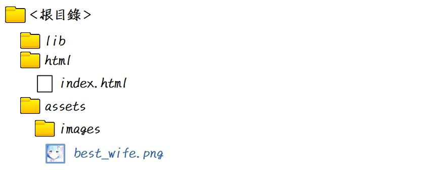

淺談前端網頁

[TOC]

# 壹、概論

前端網頁設計主要分為 HTML、CSS、Javascript。

## 關聯

以下是這三者之間的關係：

- HTML
  - 網頁的主架構，類似於樹木的樹幹。
- CSS
  - 網頁的外觀設計，類似於樹枝的排列方式、樹枝上的花草。
- JavaScript
  - 控制各種事件，例如樹枝被折斷時該發生什麼事情、什麼時候該開花結果。


# 貳、基礎認知

## 路徑

路徑可以理解為檔案儲存的位置，以下面的栗子說明：



路徑可分為絕對路徑與相對路徑，其中 "../" 代表上一層。


### 絕對路徑

絕對路徑比較難解釋，也先避免使用。

### 相對路徑


以`index.html`來說，如果要指向`best_wife.png`這張圖片，需要輸入`../assets/images/best_wife.png`。其中的意義如下：


**"../"**: 回到上一層，即根目錄。

"assets/": 在根目錄中，進入`assets`的資料夾。

"images/": 在`assets/`中，進入`images`的資料夾。

"best_wife.png": 在`images`中，選取 `best_wife.png`。

# 參、淺談語法

## HTML

當前現行版本為HTML 5，HTML 5 的撰寫原則為以標籤的意義為主，而不是樣式，樣式的部分交由CSS處理。這個部分先記得即可，稍後會做說明。


典型的HTML文件代碼：

```html
<!DOCTYPE html>
<html>
    <head>
        <meta charset="utf-8" />
        <title>網頁標題，在上面會顯示的那個</title>
    </head>
    
    <body>
        <!--會顯示的內容-->
    </body>
</html>
```


讓我們逐行來說明：

第一行的&lt;!DOCTYPE html&gt;表示這是份HTML 5的文件。

從上面的結構中，應該不難發現，幾乎所有的標記，都是由起始標記&lt;TAG&gt;與結尾標記&lt;/TAG&gt;所組成。

有些例外的(例如#4)稱之為**無元素標籤**，因為這種標籤中間不會包含內容，寫法為&lt;TAG /&gt;，即在本身後面加上斜線結尾。

### 標籤的結構

HTML標籤的結構由標籤名稱及屬性構成，具體的內容如下：

```html
<標籤名稱 屬性="屬性值" 屬性></標籤名稱>
<標籤名稱 屬性="屬性值" 屬性 />
```

有些屬性沒有屬性值，例如&lt;input&gt;中的 disabled


